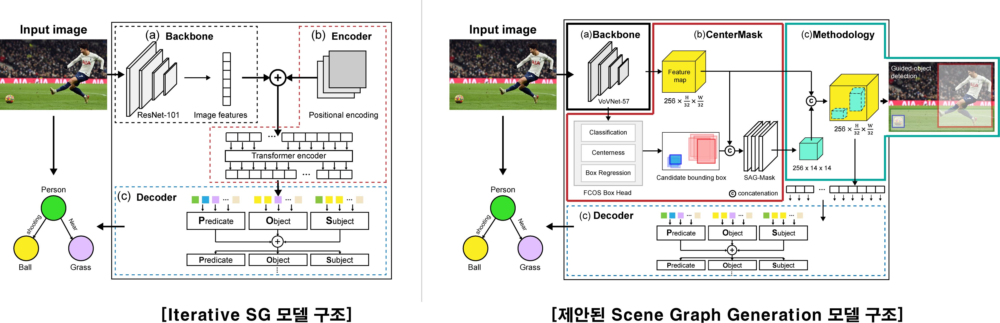

# ETIR-Iterative SG Model
### Iterative Scene Graph Generation Model Structure


[1] KHANDELWAL, Siddhesh; SIGAL, Leonid. Iterative Scene Graph Generation. arXiv preprint arXiv:2207.13440, 2022.

[2] LEE, Youngwan; PARK, Jongyoul. Centermask: Real-time anchor-free instance segmentation. In: Proceedings of the IEEE/CVF conference on computer vision and pattern recognition. 2020. p. 13906-13915.>

###### B.P.	Backbone Parameter, T.P.	Total Parameter

|Ref.|Model Name|Backbone|Detector|B.P.|T.P.|GPU|EA|
|---|---|---|---|---|---|---|---|
|[1]|IterativeSG|ResNet-101|DETR|44.5 M|93.2 M|A100|4|
|A|IterativeSG_ETIR|ResNet-101|DETR|44.5 M|93.2 M|A100|4|
|B|IterativeSG_VoVNet39|VoVNet_v2_39_FPN|DETR|44.5 M|93.2 M|A100|4|
|C|IterativeSG_VoVNet57|VoVNet_v2_57_FPN|DETR|44.5 M|93.2 M|A100|4|
|D|IterativeSG_VoVNet99|VoVNet_v2_99_FPN|DETR|44.5 M|93.2 M|A100|4|
|E|IterativeSG_VoVNet39_Centermask|VoVNet_v2_39_FPN|Centermask|44.5 M|93.2 M|A100|4|
|F|IterativeSG_VoVNet57_Centermask|VoVNet_v2_57_FPN|Centermask|44.5 M|93.2 M|A100|4|
|G|IterativeSG_VoVNet99_Centermask|VoVNet_v2_77_FPN|Centermask|44.5 M|93.2 M|A100|4|


| Ref.   | Project Name                    | Backbone        | Detector   | B.P.   | T.P.        | Epoch   | [R@20/50/100](mailto:R@20/50/100) | [ng-R@20/50/100](mailto:ng-R@20/50/100) | [zR@20/50/100](mailto:zR@20/50/100) | [mR@20/50/100](mailto:mR@20/50/100) | [hR@20/50/100](mailto:hR@20/50/100) | Inference time (s) | GPU   | EA | Batch | α    | β    |
| ------ | ------------------------------- | --------------- | ---------- | ------ | ----------- | ------- | --------------------------------- | --------------------------------------- | ----------------------------------- | ----------------------------------- | ----------------------------------- | ------------------ | ----- | -- | ----- | ---- | ---- |
| [1]    | IterativeSG       | ResNet-101      | DETR       | 44.5 M | 93,251,470  | 250,000 | 29.70/32.10                       | \-                                      | \-                                  | 8.0/8.8                             | 12.6/13.80                          | \-                 | A100  | 4  | 12    | 0.07 | \*   |
| [1]    | IterativeSG                     | ResNet-101      | DETR       | 44.5 M | 93,251,470  | \-      | 27.20/29.80                       | \-                                      | \-                                  | 15.70/17.80                         | 19.90/22.30                         | \-                 | A100  | 4  | 12    | 0.07 | 0.75 |
| Github | IterativeSG                     | ResNet-101      | DETR       | 44.5 M | 93,251,470  | 250,000 | 21.79/27.12/29.72                 | 22.72/30.52/35.47                       | 1.34/2.74/3.84                      | 11.15/15.61/17.70                   | \-                                  | \-                 | A100  | 4  | 12    | 0.07 | 0.75 |
| A      | IterativeSG_UBC                 | ResNet-101      | DETR       | 44.5 M | 93,251,470  | 250,000 | 19.39/23.72/26.08                 | 19.77/26.41/30.69                       | 0.74/2.98/3.42                      | 10.54/12.92/14.43                   | \-                                  | 0.100324           | A100  | 4  | 12    | 0.07 | 0.75 |
| B      | IterativeSG_VoVNet39            | VoVNetV2-39-FPN | DETR       | 52.6M  | 79,102,606  | 250,000 | 11.07/13.88/15.33                 | 11.40/15.52/18.27                       | 0.45/1.34/1.34                      | 6.49/8.15/10.19                     | \-                                  | 0.110973           | A100  | 4  | 12    | 0.07 | 0.75 |
| C      | IterativeSG_VoVNet57            | VoVNetV2-57-FPN | DETR       | 68.9M  | 95,362,190  | 250,000 | 11.28/14.28/15.75                 | 11.68/15.89/18.87                       | 0.45/0.89/1.34                      | 6.35/8.81/10.50                     |                                     | 0.112889           | A100  | 4  | 12    | 0.07 | 0.75 |
| D      | IterativeSG_VoVNet99            | VoVNetV2-99-FPN | DETR       | 96.9M  | 123,408,270 | 250,000 |                                   |                                         |                                     |                                     |                                     |                    | A100  | 4  | 12    | 0.07 | 0.75 |
| E      | IterativeSG_VoVNet39_CenterMask | VoVNetV2-39-FPN | CenterMask | 52.6M  | 103,168,224 | 250,000 |                                   |                                         |                                     |                                     |                                     |                    | Titan | 4  | 12    | 0.07 | 0.75 |
| F      | IterativeSG_VoVNet57_CenterMask | VoVNetV2-57-FPN | CenterMask | 68.9M  | 119,427,808 | 250,000 | 24.98/27.98/29.49                 | 27.06/33.32/37.54                       | 3.35/4.91/6.70                      | 10.99/13.08/14.38                   | \-                                  | 0.124565           | Titan | 4  | 12    | 0.07 | 0.75 |
| <b> G </b> | IterativeSG_VoVNet99_CenterMask | VoVNetV2-99-FPN | CenterMask | 96.9M  | 147,473,888 | 250,000 |                                   |                                         |                                     |                                     |                                     |                    | A100  | 4  | 12    | 0.07 | 0.75 |
|        |                                 |                 |            |        |             |         |                                   |                                         |                                     |                                     |                                     |                    |       |    |       |      |      |
| A      | IterativeSG_UBC                 | ResNet-101      | DETR       | 44.5 M | 93,251,470  | 100,000 |                                   |                                         |                                     |                                     | \-                                  |                    | A100  | 4  | 12    | 0.07 | 0.75 |
| B      | IterativeSG_VoVNet39            | VoVNetV2-39-FPN | DETR       | 52.6M  | 79,102,606  | 100,000 |                                   |                                         |                                     |                                     | \-                                  |                    | A100  | 4  | 12    | 0.07 | 0.75 |
| C      | IterativeSG_VoVNet57            | VoVNetV2-57-FPN | DETR       | 68.9M  | 95,362,190  | 100,000 | 6.40/8.18/9.46                    | 6.67/9.27/11.07                         | 0.00/0.045/0.089                    | 3.34/4.25/6.25                      | \-                                  | 0.117365           | A100  | 4  | 12    | 0.07 | 0.75 |
| D      | IterativeSG_VoVNet99            | VoVNetV2-99-FPN | DETR       | 96.9M  | 123,408,270 | 100,000 | 5.61/7.38/8.53                    | 5.53/7.91/10.00                         | 0.00/0.045/0.089                    | 2.97/3.65/4.27                      | \-                                  | 0.116621           | A100  | 4  | 12    | 0.07 | 0.75 |
| E      | IterativeSG_VoVNet39_CenterMask | VoVNetV2-39-FPN | CenterMask | 52.6M  | 103,168,224 | 100,000 | 18.35/20.85/22.11                 | 19.43/23.92/27.05                       | 0.89/2.90/3.35                      | 7.56/9.84/10.44                     |                                     | 0.119549           | Titan | 4  | 12    | 0.07 | 0.75 |
| F      | IterativeSG_VoVNet57_CenterMask | VoVNetV2-57-FPN | CenterMask | 68.9M  | 119,427,808 | 100,000 | 16.91/19.09/20.14                 | 18.07/22.54/25.60                       | 0.45/2.23/2.46                      | 7.27/8.54/9.02                      | \-                                  | 0.124869           | Titan | 4  | 12    | 0.07 | 0.75 |
| G      | IterativeSG_VoVNet99_CenterMask | VoVNetV2-99-FPN | CenterMask | 96.9M  | 147,473,888 | 100,000 | 11.24/12.88/13.78                 | 11.88/15.00/16.98                       | 0.22/0.67/0.156                     | 4.10/4.96/5.56                      | \-                                  | 0.152235           | A100  | 4  | 12    | 0.07 | 0.75 |


# Iterative Scene Graph Generation

Below code is the reference paper titled ["Iterative Scene Graph Generation"](https://openreview.net/pdf?id=i0FnLiIRj6U).

## Requirements
The following packages are needed to run the code.
- `python == 3.8.5`
- `PyTorch == 1.8.2`
- `detectron2 == 0.6`
- `h5py`
- `imantics`
- `easydict`
- `cv2 == 4.5.5`
- `scikit-learn`
- `scipy`
- `pandas`

We use the Visual Genome filtered data widely used in the Scene Graph community. 
Please see the public repository of the paper  [Unbiased Scene Graph Generation repository](https://github.com/KaihuaTang/Scene-Graph-Benchmark.pytorch/blob/master/DATASET.md) on instructions to download this dataset. After downloading the dataset you should have the following 4 files: 
- `VG_100K `directory containing all the images
- `VG-SGG-with-attri.h5` 
- `VG-SGG-dicts-with-attri.json` (Can be found in the same repository [here](https://github.com/KaihuaTang/Scene-Graph-Benchmark.pytorch/tree/master/datasets/vg))
- `image_data.json` (Can be found in the same repository [here](https://github.com/KaihuaTang/Scene-Graph-Benchmark.pytorch/tree/master/datasets/vg))

## Train Iterative Model
To enable faster model convergence, we pre-train DETR on Visual Genome. We replicate the DETR decoder weights three times, and initialize our models three decoders with it. For convenience, the pretrained weights (with the decoder replication) are made available [here](https://drive.google.com/drive/folders/1CdcYdcYEvkZHz-I1IFF8sBxVMWSyWIkh?usp=share_link). To use these weights during training, simply use the `MODEL.WEIGHTS <Path to downloaded checkpoint>` flag in the training command.

Our proposed iterative model can be trained using the following command:
```python
python train_iterative_model.py --resume --num-gpus <NUM_GPUS> --config-file configs/iterative_model.yaml OUTPUT_DIR <PATH TO CHECKPOINT DIR> DATASETS.VISUAL_GENOME.IMAGES <PATH TO VG_100K IMAGES> DATASETS.VISUAL_GENOME.MAPPING_DICTIONARY <PATH TO VG-SGG-dicts-with-attri.json> DATASETS.VISUAL_GENOME.IMAGE_DATA <PATH TO image_data.json> DATASETS.VISUAL_GENOME.VG_ATTRIBUTE_H5 <PATH TO VG-SGG-with-attri.h5> MODEL.DETR.OVERSAMPLE_PARAM <Alpha Value> MODEL.DETR.UNDERSAMPLE_PARAM <Twice the Beta Value> SOLVER.CLIP_GRADIENTS.CLIP_VALUE 0.01 SOLVER.IMS_PER_BATCH 12 MODEL.DETR.NO_OBJECT_WEIGHT 0.1 MODEL.WEIGHTS <PATH TO DETR Pretrained Model>
```
To set the `α` value use `MODEL.DETR.OVERSAMPLE_PARAM` flag, and set the `β` value using the `MODEL.DETR.UNDERSAMPLE_PARAM`. Note that `MODEL.DETR.UNDERSAMPLE_PARAM` should be specified as twice the desired β value. So for `β=0.75` use `MODEL.DETR.UNDERSAMPLE_PARAM 1.5`.

**Note**: If the code fails, try running it on a single GPU first in order to allow some preprocessed files to be generated. This is a one-time step. Once the code runs succesfully on a single GPU, you can run it on multiple GPUs as well. Additionally, the code, by default, is configured to run on 4 GPUs with a batch size of 12. If you run out of memory, change the batch size by using the flag `SOLVER.IMS_PER_BATCH <NUM IMAGES IN BATCH>`.

To evaluate the code, use the following command:
```python
python train_iterative_model.py --resume --eval-only --num-gpus <NUM_GPUS> --config-file configs/iterative_model.yaml OUTPUT_DIR <PATH TO CHECKPOINT DIR> DATASETS.VISUAL_GENOME.IMAGES <PATH TO VG_100K IMAGES> DATASETS.VISUAL_GENOME.MAPPING_DICTIONARY <PATH TO VG-SGG-dicts-with-attri.json> DATASETS.VISUAL_GENOME.IMAGE_DATA <PATH TO image_data.json> DATASETS.VISUAL_GENOME.VG_ATTRIBUTE_H5 <PATH TO VG-SGG-with-attri.h5>
```
You can find our model weights for `α=0.07` and `β=0.75` [here](https://drive.google.com/drive/folders/1L2H2e-UfyKfbbmM34LaJfT6S49VTfZDY?usp=share_link). To use these weights during evaluation, simply use the `MODEL.WEIGHTS <Path to downloaded checkpoint>` flag in the evaluation command. To check if the code is running correctly on your machine, the released checkpoint should give you the following metrics on the Visual Genome test set `VG_test`.

```python
SGG eval:     R @ 20: 0.2179;     R @ 50: 0.2712;     R @ 100: 0.2972;  for mode=sgdet, type=Recall(Main).
SGG eval:  ng-R @ 20: 0.2272;  ng-R @ 50: 0.3052;  ng-R @ 100: 0.3547;  for mode=sgdet, type=No Graph Constraint Recall(Main).
SGG eval:    zR @ 20: 0.0134;    zR @ 50: 0.0274;    zR @ 100: 0.0384;  for mode=sgdet, type=Zero Shot Recall.
SGG eval:    mR @ 20: 0.1115;    mR @ 50: 0.1561;    mR @ 100: 0.1770;  for mode=sgdet, type=Mean Recall.
```

### IterativeSG
<div class="snippet-clipboard-content notranslate position-relative overflow-auto" data-snippet-clipboard-copy-content="@inproceedings{Yu2022CoCaCC,
  title   = {Iterative Scene Graph Generation},
  author  = {Siddhesh Khandelwal and Leonid Sigal},
  year    = {NeurIPS 2022}
}"><pre class="notranslate"><code>
@inproceedings{Yu2022CoCaCC,
  title   = {Iterative Scene Graph Generation},
  author  = {Siddhesh Khandelwal and Leonid Sigal},
  year    = {NeurIPS 2022}
}
</code></pre></div>

### CenterMask
<div class="snippet-clipboard-content notranslate position-relative overflow-auto" data-snippet-clipboard-copy-content="@inproceedings{Yu2022CoCaCC,
  title   = {enterMask: Real-Time Anchor-Free Instance Segmentation},
  author  = {Lee, Youngwan and Park, Jongyoul},
  year    = {CVPR 2020}
}"><pre class="notranslate"><code>
@inproceedings{lee2020centermask,
  title   = {enterMask: Real-Time Anchor-Free Instance Segmentation},
  author  = {Lee, Youngwan and Park, Jongyoul},
  year    = {CVPR 2020}
}
</code></pre></div>
